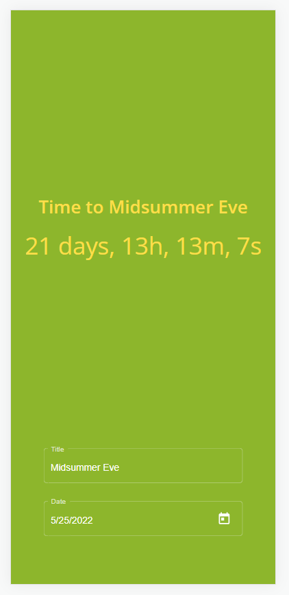
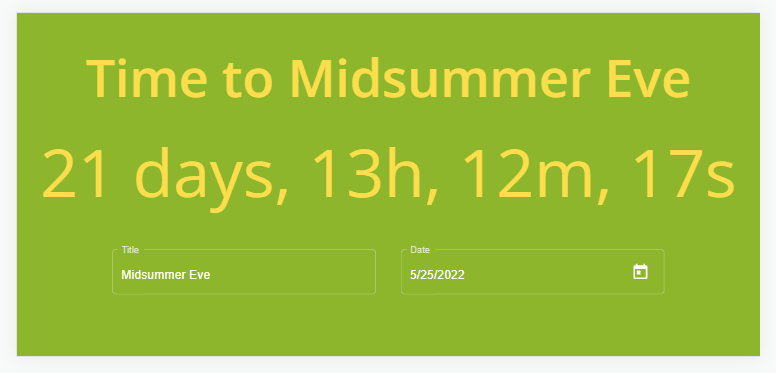

# NaturalCycles test assignment

https://magenta-paletas-24d5da.netlify.app

## Links

You can access application by using url: https://magenta-paletas-24d5da.netlify.app

Repository: https://github.com/zhuravlovaira/natural-cycle

Design: https://www.figma.com/file/tupS0Q8tS0ZPJmMgoU66xB/Frontend-Challenge

## Project set up

If you want to run project locally:

1. Clone repository `git clone https://github.com/zhuravlovaira/natural-cycle.git`
2. Install dependencies. Run `npm install --save-exact`
3. Run server: `npm start`

## Optional goals

Suggestions on how this solution can be improved:
* Make builds using capacitor in order to create Hybrid app and run it natively on iOS, Android, and the Web
* Use another storage. For storing data I went for the easiest option (localStorage) for the sake of saving time. For production deploy I would create a separate storage service and inject it into the component(to comply with dependency inversion principle)  
* Extend design with conditions like: error messages, max characters size, indication that timer is over. Implementing these features.
* Write e2e tests
* Improve unit tests coverage.

